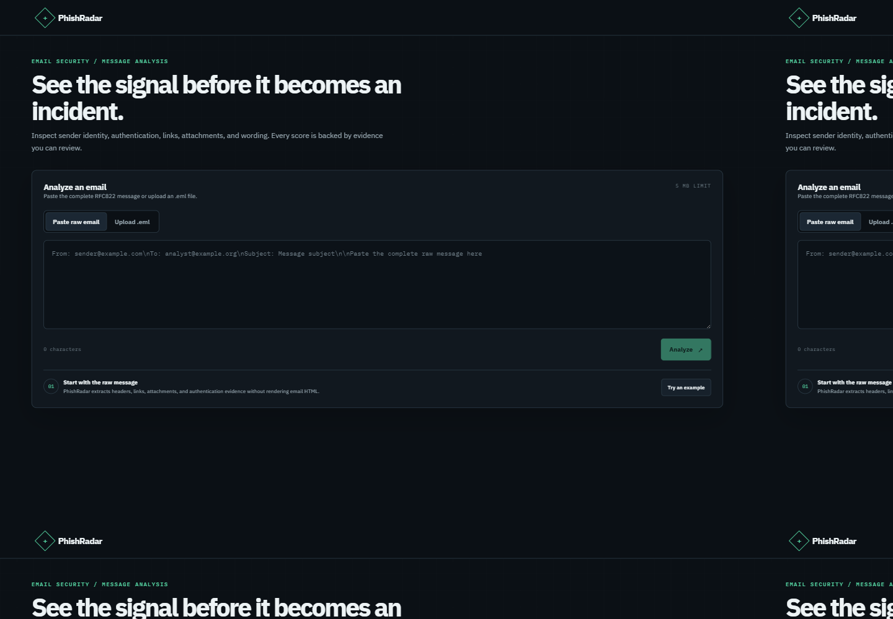
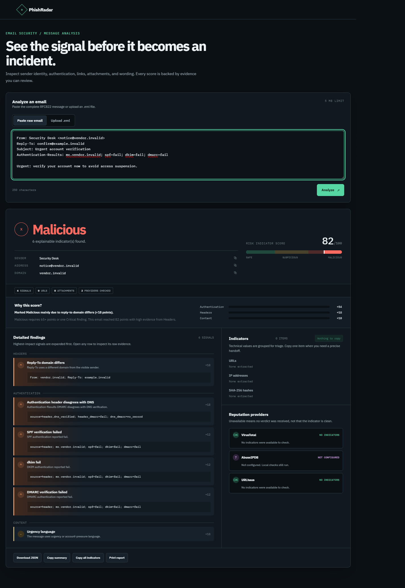

# PhishRadar

**Explainable phishing-email triage built with Python and FastAPI.**

[](.github/workflows/ci.yml) [](#tests)

PhishRadar is a local-first security application for analyzing suspicious email. Submit a raw message or `.eml` file to inspect sender identity, authentication signals, URLs, attachments, and message content. The service combines those signals into a transparent risk score, a verdict, supporting findings, and extracted indicators of compromise (IOCs).

PhishRadar is an analyst aid, not a guarantee that a message is safe. A `Safe` verdict means the configured checks did not cross the risk thresholds; it does not prove that an email is benign.

## Overview

PhishRadar is designed for security analysts and anyone who needs to triage a suspicious email. It accepts raw RFC822 messages or `.eml` files, performs local parsing and detection, optionally checks extracted indicators with reputation providers, and presents the results in a browser dashboard or JSON API. Findings include evidence and scoring details so a reviewer can understand why a message was flagged.

| Attribute | Details |
| --- | --- |
| Project type | Local-first email security analysis web application |
| Backend | Python, FastAPI, asynchronous provider lookups |
| Analysis | RFC822/MIME parsing, sender and URL heuristics, DNS SPF/DMARC checks, DKIM signature verification |
| Integrations | VirusTotal, AbuseIPDB, and opt-in URLhaus |
| Data handling | SQLite reputation cache; complete message and attachment bytes remain local |
| Quality checks | 25 automated tests pass; the three-message sanitized evaluation set currently scores 3/3 (illustrative only) |

## Screenshots

### Analysis workspace



### Example analysis report



This report uses synthetic `.invalid` email addresses and contains no live reputation indicators. The evaluation sample set is small and does not represent general detection accuracy.

### Technology

Python 3.10+, FastAPI, Uvicorn, HTTPX, SQLite, dnspython, dkimpy, pytest, pytest-cov, Ruff, and Docker Compose.

## Contents

- [Overview](#overview)
- [Features](#features)
- [Current implementation status](#current-implementation-status)
- [Screenshots](#screenshots)
- [Architecture](#architecture)
- [Requirements](#requirements)
- [Run locally](#run-locally)
- [Configure reputation providers](#configure-reputation-providers)
- [How scoring works](#how-scoring-works)
- [API](#api)
- [Privacy and security](#privacy-and-security)
- [Tests](#tests)
- [Evaluation](#evaluation)
- [Limitations and roadmap](#limitations-and-roadmap)

## Features

- Paste raw RFC822 headers and body, or upload an `.eml` file up to 5 MB.
- Compare visible sender, `Reply-To`, and `Return-Path` domains.
- Read SPF, DKIM, and DMARC results from `Authentication-Results` headers.
- Extract URLs from plain-text and HTML email parts, compare displayed URLs with anchor destinations, and flag shorteners and supported brand lookalikes.
- Hash attachments with MD5, SHA-1, and SHA-256; flag selected risky file extensions. Attachment content is never executed.
- Detect selected urgency and credential-related wording, plus HTML forms/password fields.
- Optionally query VirusTotal for URL, public IP, and file-hash reports.
- Optionally query AbuseIPDB for public sending-IP reputation.
- Optionally query URLhaus for URL malware listings; URLhaus is disabled by default because URLs are sent to an external service.
- Independently verify SPF and DMARC using DNS, and verify DKIM signatures cryptographically.
- Show evidence and points for each finding, plus copyable IOCs and a downloadable JSON report.
- Add contextual MITRE ATT&CK technique references to selected email findings; mappings do not affect scores or claim attribution.
- Explain provider failures, including rejected API keys, rate limits, rejected requests, provider errors, connection failures, and invalid responses. Failed lookups are not treated as clean verdicts.
- Provide a dark-mode web interface and FastAPI-generated API documentation.

## Current implementation status

PhishRadar is a functional local email triage tool. The main analysis workflow, browser dashboard, API contract, provider integrations, DNS/DKIM checks, automated tests, CI configuration, and evaluation harness are implemented. It is not a production mail gateway or a guarantee that an email is safe.

| Area | Current status |
| --- | --- |
| Browser workflow | Implemented. Paste raw email or upload/drop an `.eml` file, with a 5 MB limit, inline validation, staged loading state, and designed error states. |
| Analyst dashboard | Implemented. Verdict-first score summary, severity-driven findings, explainable score breakdown, sender identity rows, collapsible evidence, copyable IOCs, provider status, JSON download, summary copy, and print-friendly output. |
| API | Implemented. `POST /api/analyze` accepts raw email text or `.eml` uploads and returns score, verdict, findings, parsed metadata, IOCs, authentication results, and enrichment status. FastAPI docs are available at `/docs`. |
| Email parsing | Implemented. RFC822/MIME parsing supports plain text, HTML inspection as text, multipart messages, attachment metadata, and MD5/SHA-1/SHA-256 hashing. Attachments are never executed. |
| Local detections | Implemented. Sender/Reply-To/Return-Path comparison, brand impersonation, authentication-header checks, URL extraction, link mismatch, shortener and lookalike checks, HTTP links, selected wording, HTML forms/password fields, and risky attachment extensions. |
| Authentication verification | Implemented with limitations. SPF and DMARC are checked through DNS, DKIM signatures are cryptographically verified, header-vs-DNS disagreements are reported, and unavailable/no-record states remain distinct. SPF support intentionally covers a documented subset of mechanisms. |
| Reputation providers | Implemented and optional. VirusTotal checks up to 10 URLs, 10 file hashes, and a sending-IP candidate. AbuseIPDB checks the extracted public sending IP. URLhaus checks up to 10 URLs when explicitly enabled. All use SQLite caching and explain provider failures without treating them as clean results. |
| Scoring | Implemented. Transparent weighted findings are capped at 100 and produce Safe, Suspicious, or Malicious verdicts using score and severity thresholds. The score is an indicator, not a probability. |
| Privacy boundary | Implemented. Full email and attachment bytes stay local; VirusTotal receives extracted indicators, AbuseIPDB receives the public sending IP, and message HTML is not rendered or fetched. |
| Quality gates | Implemented. Tests use mocked HTTP, DNS, and DKIM boundaries; Ruff linting and pytest coverage run in CI on Python 3.10 and 3.12. The local labeled evaluation harness currently reports 3/3 on its tiny sanitized sample set. |

### Ready to use locally

The application runs with no API keys for local parsing, heuristics, scoring, the dashboard, and tests. Add provider keys only when external reputation lookups are wanted. Start it with `uvicorn app.main:app --reload`, then open <http://127.0.0.1:8000>.

### Remaining production gaps

Before production deployment, the project still needs stronger operational controls such as authentication and authorization, request rate limiting at the API boundary, structured audit logging and redaction review, a larger representative evaluation corpus, broader SPF mechanism support, and deployment hardening. The roadmap also includes `.msg` parsing, IMAP retrieval, URL expansion, additional reputation sources, PDF reports, ML classification, historical dashboards, and STIX/TAXII export.

## Architecture

```text
app/
	main.py                    FastAPI routes and analysis orchestration
	analyzers/
		email_parser.py          RFC822/.eml parsing, body parts, attachment hashes
		headers.py               Sender/authentication checks and sending-IP extraction
		urls.py                  URL extraction, mismatch, shortener, and lookalike checks
		dns_auth.py              DNS SPF/DMARC checks and DKIM verification
		attachments.py           Risky-extension checks
		content.py               Urgency, credential, and HTML-form checks
	integrations/
		virustotal.py            VirusTotal v3 reports, SQLite cache, request limiter
		abuseipdb.py             AbuseIPDB public-IP lookups and cache
		urlhaus.py               Opt-in URL malware-listing lookups and cache
		errors.py                Safe provider error codes and messages
	scoring/
		engine.py                Weighted score, verdict, report, and IOC assembly
	static/
		index.html               Responsive browser interface
tests/
	test_analysis.py           Parsing, analyzer, IOC, and scoring tests
	test_api.py                Endpoint and end-to-end report tests
	test_integrations.py       Mocked provider success and failure tests
```

The request flow is: ingest the email bytes, parse message parts, run local analyzers, independently verify authentication, optionally query configured reputation providers, combine findings, then return a JSON report for the UI or API caller. The complete message and attachment bytes are not sent to VirusTotal, AbuseIPDB, or URLhaus. VirusTotal receives extracted indicators; AbuseIPDB receives the public sending IP; URLhaus receives submitted URLs only when enabled.

## Requirements

- Python 3.10 or newer with `pip`, or Docker with the Docker Compose plugin.
- No API keys are required for local parsing, heuristic checks, scoring, tests, or the web interface.
- VirusTotal and AbuseIPDB credentials are optional and must be obtained from your own provider accounts. URLhaus does not require an API key but must be explicitly enabled.
- Use sanitized sample messages. Do not use a real mailbox or account to run the demo.

Never commit `.env`, put API keys into source files, or paste secrets into documentation or chat. The repository `.gitignore` excludes `.env`.

## Run locally

From the project directory in PowerShell:

```powershell
py -m venv .venv
.\.venv\Scripts\Activate.ps1
python -m pip install -r requirements.txt
uvicorn app.main:app --reload
```

Open the analyzer at <http://127.0.0.1:8000> or the interactive API docs at <http://127.0.0.1:8000/docs>.

To run the tests:

```powershell
python -m pytest -q
```

## Configure reputation providers

Start with local-only analysis by copying the example environment file:

```powershell
Copy-Item .env.example .env
```

Edit `.env` locally and set only the providers you want to use:

```dotenv
VIRUSTOTAL_API_KEY=your_virustotal_key
ABUSEIPDB_API_KEY=your_abuseipdb_key
ABUSEIPDB_REQUEST_INTERVAL=1
URLHAUS_ENABLED=false
URLHAUS_REQUEST_INTERVAL=1
PHISHRADAR_CACHE_DB=data/reputation-cache.sqlite3
```

Restart Uvicorn after changing `.env`; settings are loaded when the application starts.

### VirusTotal

Set `VIRUSTOTAL_API_KEY` to enable VirusTotal v3 lookups. PhishRadar checks up to 10 URLs, up to 10 attachment SHA-256 hashes, and the extracted public sending-IP candidate. It does not upload attachment bytes. A VirusTotal result contributes a finding when its report has malicious or suspicious detections.

Results are cached in SQLite for 24 hours. Requests are limited to four per minute in the running process. When there are many uncached indicators, analysis may take longer while the limiter waits. A lookup can return a report, no report (`not_found`), or a specific API error. A missing report is not proof of safety.

### AbuseIPDB

Set `ABUSEIPDB_API_KEY` to enable AbuseIPDB checks. PhishRadar checks the extracted public sending IP using `/api/v2/check`, requests data from the previous 90 days, and caches each result for 24 hours. The free tier has account-specific daily quotas; `ABUSEIPDB_REQUEST_INTERVAL` spaces requests in the running process. High abuse-confidence scores produce a critical finding, while moderate scores produce a high-severity finding.

Only the public sending IP candidate is sent to AbuseIPDB. Message contents, URLs, headers, and attachment bytes are not uploaded. A provider error is reported as unavailable and never treated as a clean IP.

### URLhaus

Set `URLHAUS_ENABLED=true` to enable URLhaus lookups. No API key is required for the URLhaus community API. PhishRadar checks up to 10 extracted URLs, caches results for 24 hours, and spaces requests using `URLHAUS_REQUEST_INTERVAL`. A URL listed by URLhaus produces a critical finding.

URLhaus receives submitted URLs only when enabled. Do not enable it for confidential or tokenized messages; URLs may contain personal data, session identifiers, or password-reset tokens. URLhaus is disabled by default.

### DNS-based authentication verification

PhishRadar checks the sender domain’s SPF TXT record and evaluates the sending IP against supported `include`, `a`, `mx`, `ip4`, `ip6`, and `all` mechanisms. It reads the DMARC policy from `_dmarc.<domain>` and reports SPF/DKIM alignment with the visible `From` domain. DNS failures, missing records, and unsupported SPF mechanisms are distinct unavailable or no-record states, not authentication passes.

The report keeps the original `Authentication-Results` values and independently derived values. A disagreement is emitted as a separate high-severity finding with `source=header,dns_verified` evidence. DKIM signatures are verified against the selector’s DNS-published public key; a cryptographic failure is distinct from an absent signature. DNS and DKIM checks may require network access to authoritative DNS unless mocked in tests.

## How scoring works

The score is the sum of finding points, capped at 100. It is an indicator score, not a probability. The verdict uses both the score and finding severity:

| Verdict | Rule |
| --- | --- |
| `Safe` | Score below 30 and no high- or critical-severity finding |
| `Suspicious` | Score at least 30, or at least one high-severity finding |
| `Malicious` | Score at least 65, or at least one critical-severity finding |

Current heuristic weights:

| Check | Points | Severity |
| --- | ---: | --- |
| Reply-To domain differs from From | 18 | High |
| Return-Path domain differs from From | 10 | Medium |
| Known brand in sender display name but not sender domain | 24 | High |
| SPF/DKIM/DMARC reports `fail` | 12 per failure | High |
| SPF/DKIM/DMARC reports `softfail`, `permerror`, `temperror`, or `none` | 7 per result | Medium |
| Brand-like URL hostname | 24 | High |
| Displayed URL hostname differs from link destination | 20 | High |
| Known URL shortener | 10 | Medium |
| HTTP (not HTTPS) URL | 5 | Low |
| Urgency wording | 5 per matched phrase, capped at 15 | Medium |
| Credential/sensitive-data wording | 4 per matched phrase, capped at 12 | Medium |
| HTML form or password input | 28 | High |
| Risky attachment extension | 22 | High |
| VirusTotal malicious result | 40 | Critical |
| VirusTotal suspicious result | 18 | High |
| AbuseIPDB abuse confidence at least 75 | 35 | Critical |
| AbuseIPDB abuse confidence 25–74 | 18 | High |
| URLhaus malicious URL listing | 35 | Critical |
| DNS-verified SPF fail | 12 | High |
| DNS-verified SPF softfail | 7 | Medium |
| DMARC alignment failure under quarantine/reject policy | 12 | High |
| Header/DNS authentication mismatch | 18 | High |
| DKIM cryptographic verification failure | 12 | High |

The supported sender-name/URL lookalike brand list currently includes Amazon, Apple, Google, Microsoft, Netflix, and PayPal. The content checks use a small phrase list and are not an NLP or machine-learning classifier. Weights are transparent demonstration heuristics, not calibrated probabilities.

Selected findings include ATT&CK references for Spearphishing Attachment (`T1566.001`), Spearphishing Link (`T1566.002`), or Web Portal Capture (`T1056.003`). These are contextual associations for investigation, not confirmation that a technique occurred and not threat-group attribution. ATT&CK metadata is informational and does not change the risk score.

## API

`POST /api/analyze` accepts `multipart/form-data` with one of:

- `raw_email`: pasted raw message text, including headers and body.
- `file`: an `.eml` upload.

Example using a sanitized local message:

```sh
curl -X POST http://127.0.0.1:8000/api/analyze \
	-F "file=@sample.eml"
```

The JSON report contains:

- `score`, `verdict`, and a short `summary`.
- `findings`: category, rule, points, severity, explanation, and evidence.
- `findings[].attack` (when applicable): technique ID, name, tactic, reference URL, and a contextual interpretation note.
- `headers`, `urls`, and `attachments`: parsed metadata and hashes.
- `iocs`: extracted `urls`, `ips`, and `sha256` hashes.
- `enrichment.providers.virustotal`, `enrichment.providers.abuseipdb`, and `enrichment.providers.urlhaus`: provider status and per-indicator lookup results.
- `headers.dns_authentication` and `headers.dkim_verification`: independent authentication results and alignment metadata.

Provider status values include `not_configured`, `no_indicators`, `checked`, `partial`, and `unavailable`. Individual results distinguish states such as `found`, `not_found`, and `unavailable`. A failed lookup includes a safe `error_code` and user-facing `error_message`; it is not represented as a clean verdict. HTTP 400 errors are returned for empty input, 413 for files over 5 MB, and 415 for non-`.eml` uploads. Other parse/analysis failures return 422.

HTML content is inspected as text and is not rendered in the browser. Attachments are hashed, never executed. FastAPI's interactive schema is available at `/docs`.

## Privacy and security

- Treat email headers, bodies, URLs, and attachments as untrusted input.
- Message HTML is parsed but not rendered; remote images and scripts are not loaded by the analyzer.
- Attachment bytes are hashed locally and never executed or uploaded by this application.
- If VirusTotal is enabled, extracted URLs, the sending-IP candidate, and attachment hashes are sent to VirusTotal for lookup.
- If AbuseIPDB is enabled, only the extracted public sending IP is sent for lookup; no message, URL, or attachment bytes are sent.
- If URLhaus is enabled, extracted URLs are sent to URLhaus for lookup. Keep it disabled for confidential or tokenized messages.
- DNS authentication checks query sender-domain records, and DKIM verification queries the selector’s public key; message content is not sent to those DNS services by this application.
- API keys belong in local `.env` only. Rotate credentials that have been exposed.
- SQLite reputation data is stored under `data/` by default. Do not commit that directory or sensitive analysis exports.
- Logs record analysis summary information such as verdict, score, URL count, and attachment count; avoid sharing logs from runs involving sensitive messages.

## Tests

Run the test suite with:

```powershell
python -m pytest -q
```

Integration tests use mocked HTTP transports and mocked DNS/DKIM boundaries. They do not require API keys or live network access. Coverage includes email parsing, header and URL analysis, score/verdict behavior, API behavior, VirusTotal, AbuseIPDB, and URLhaus caching, DNS authentication, DKIM outcomes, and provider error messages.

The CI workflow runs Ruff and `pytest -q --cov=app --cov-report=term-missing` on Python 3.10 and 3.12. Run the same checks locally with:

```powershell
python -m ruff check app tests eval
python -m pytest -q --cov=app --cov-report=term-missing
```

## Docker

Docker is an alternative to a local Python installation. Optional settings are read from `.env`; omit it to run local-only analysis.

```sh
docker compose up --build
```

Open <http://127.0.0.1:8000>. SQLite cache data persists in the named `phishradar-data` volume. Stop the service with `docker compose down`; removing the volume also removes its cache.

## Evaluation

The repository includes three sanitized `.eml` samples under `eval/samples/`, labels in `eval/labels.json`, and a local-only evaluator. It reports each sample’s expected and predicted verdict, accuracy, and a Safe/Suspicious/Malicious confusion matrix:

```powershell
python eval/run_eval.py
```

The current sample set scores 3/3 (100%). This is a tiny demonstration set, not a general accuracy claim; expand the labels and samples before using it as a benchmark.

## Limitations and roadmap

Implemented in this version:

- `.eml`/raw-email ingestion, local heuristics, weighted explainable scoring, JSON API/report, VirusTotal, AbuseIPDB, and URLhaus lookups, DNS SPF/DMARC verification, DKIM verification, SQLite caching, CI, evaluation tooling, and the browser dashboard.

Not implemented yet:

- `.msg` parsing, IMAP retrieval, full SPF mechanism coverage beyond the supported subset, Received-chain geolocation, URL expansion, PhishTank, PDF reports, ML classification, historical dashboards, and STIX/TAXII export.

The current message-size limit is 5 MB. VirusTotal, AbuseIPDB, and URLhaus account/service quotas apply. `Safe` is not a guarantee of legitimacy, and reputation data can be incomplete, delayed, or unavailable.